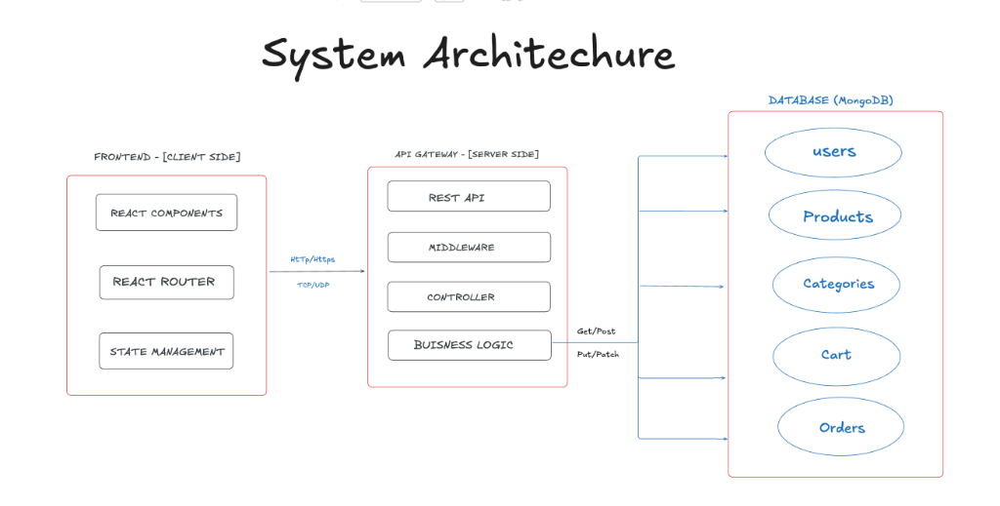
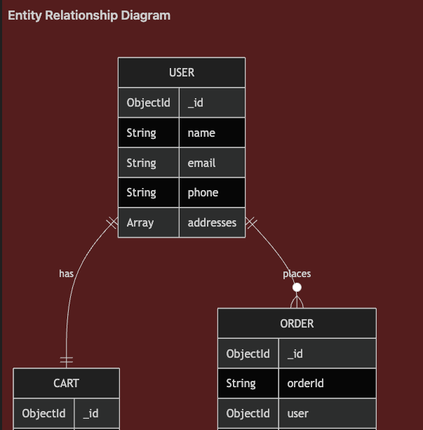
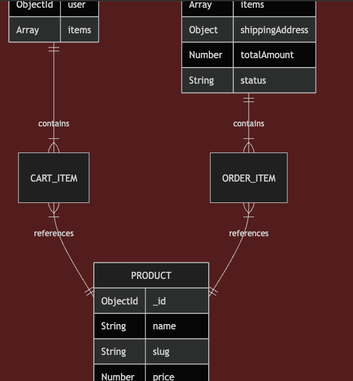
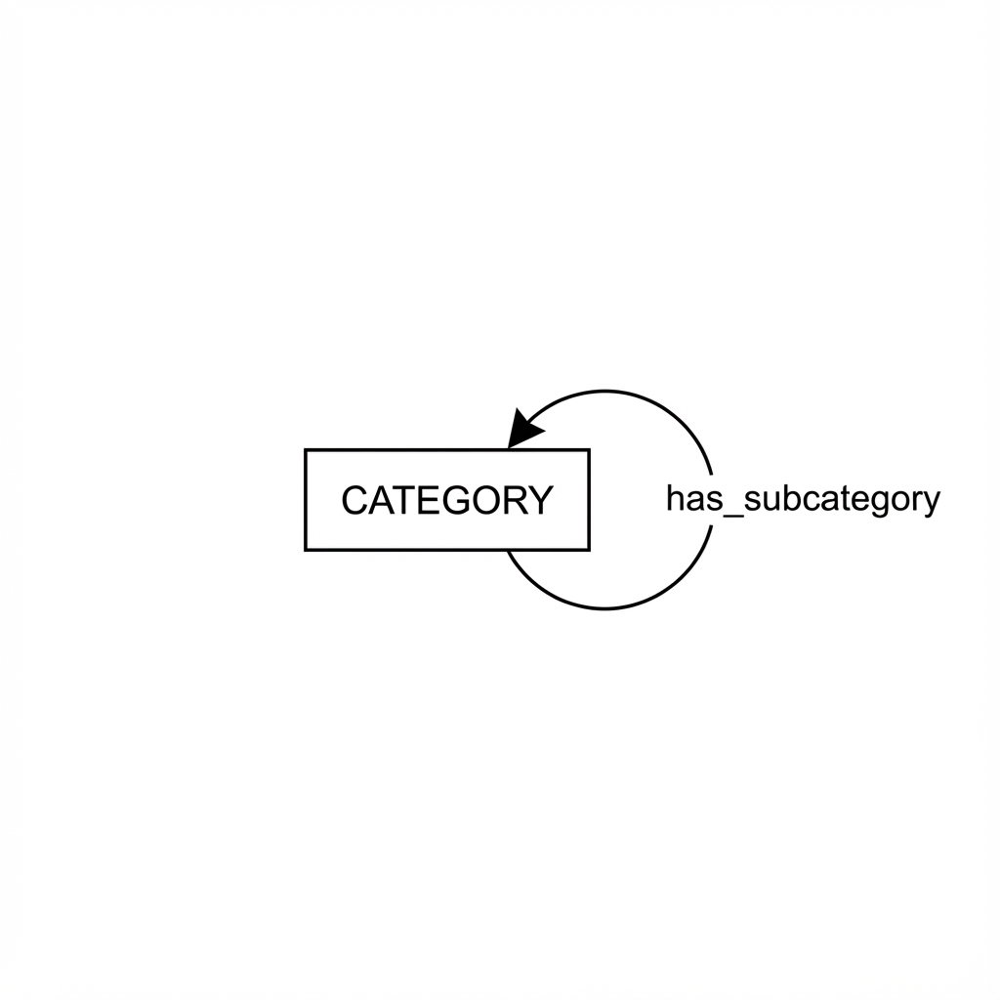
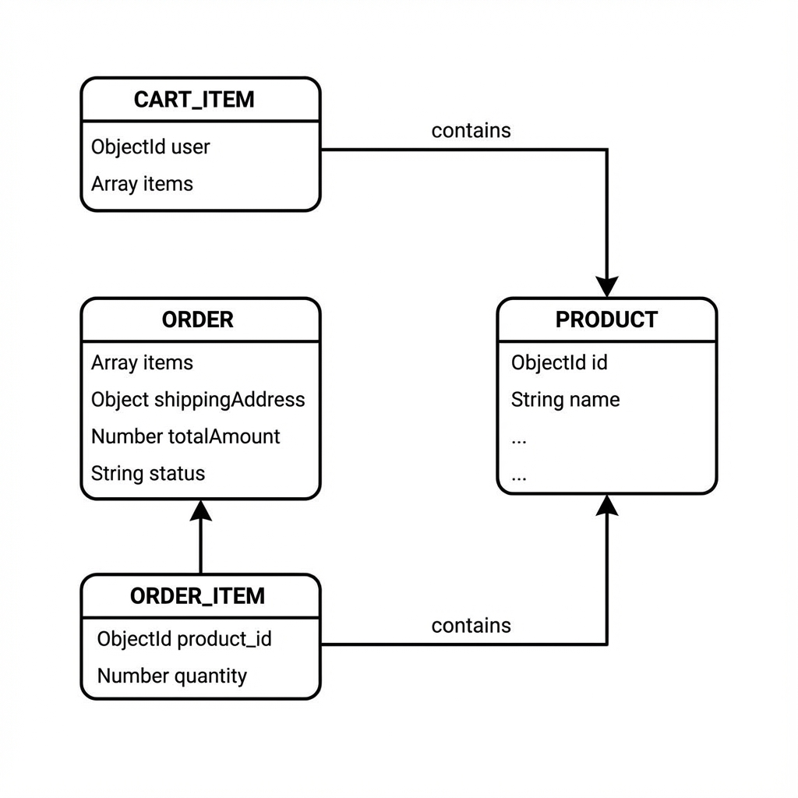

# Dipkart - Flipkart Clone



## 📊 Schema Design






A full-stack e-commerce application built with React (Vite) and Node.js/Express, replicating core Flipkart features.

## 🚀 Features

### Frontend
- **Modern React (Vite)** with fast HMR
- **Responsive Design** for all screen sizes
- **Product Catalog** with search, filters, and categories
- **Shopping Cart** with real-time updates
- **Order Management** with status tracking
- **Toast Notifications** for user feedback

### Backend
- **RESTful API** with Express.js
- **MongoDB** database with Mongoose ODM
- **Product Management** with categories
- **Cart & Order System**
- **Error Handling** middleware

## 📁 Project Structure

```
Flipkart-clone/
├── backend/
│   ├── src/
│   │   ├── config/        # Database configuration
│   │   ├── controllers/   # Route handlers
│   │   ├── middleware/    # Custom middleware
│   │   ├── models/        # Mongoose schemas
│   │   ├── routes/        # API routes
│   │   ├── seeds/         # Database seed data
│   │   └── app.js         # Express app
│   ├── .env.example
│   └── package.json
├── frontend/
│   ├── src/
│   │   ├── components/    # Reusable UI components
│   │   ├── context/       # React context (Cart)
│   │   ├── pages/         # Page components
│   │   ├── services/      # API service
│   │   └── App.jsx        # Main app
│   ├── .env.example
│   └── package.json
└── README.md
```

## 🛠️ Tech Stack

**Frontend:**
- React 18 + Vite
- React Router v6
- CSS3 (Custom styling)
- Inter font (Google Fonts)

**Backend:**
- Node.js + Express
- MongoDB + Mongoose
- RESTful API design

## 🏃‍♂️ Getting Started

### Prerequisites
- Node.js v18+
- MongoDB (local or Atlas)

### Backend Setup

```bash
cd backend
npm install

# Create .env file
cp .env.example .env
# Edit .env with your MongoDB URI

# Seed the database
npm run seed

# Start server
npm run dev
```

### Frontend Setup

```bash
cd frontend
npm install

# Create .env file
cp .env.example .env
# Edit .env with API URL

# Start development server
npm run dev
```

## 🔗 API Endpoints

| Method | Endpoint | Description |
|--------|----------|-------------|
| GET | /api/v1/products | Get all products |
| GET | /api/v1/products/:id | Get single product |
| GET | /api/v1/categories | Get all categories |
| GET | /api/v1/cart | Get user's cart |
| POST | /api/v1/cart/add | Add to cart |
| PUT | /api/v1/cart/update | Update cart item |
| DELETE | /api/v1/cart/:productId | Remove from cart |
| POST | /api/v1/orders | Create order |
| GET | /api/v1/orders | Get user's orders |

## 📱 Screenshots

- Homepage with categories and deals
- Product listing with filters
- Product detail page
- Shopping cart
- Checkout flow
- Order history

## 👤 Author

**Devansh Vashist**

